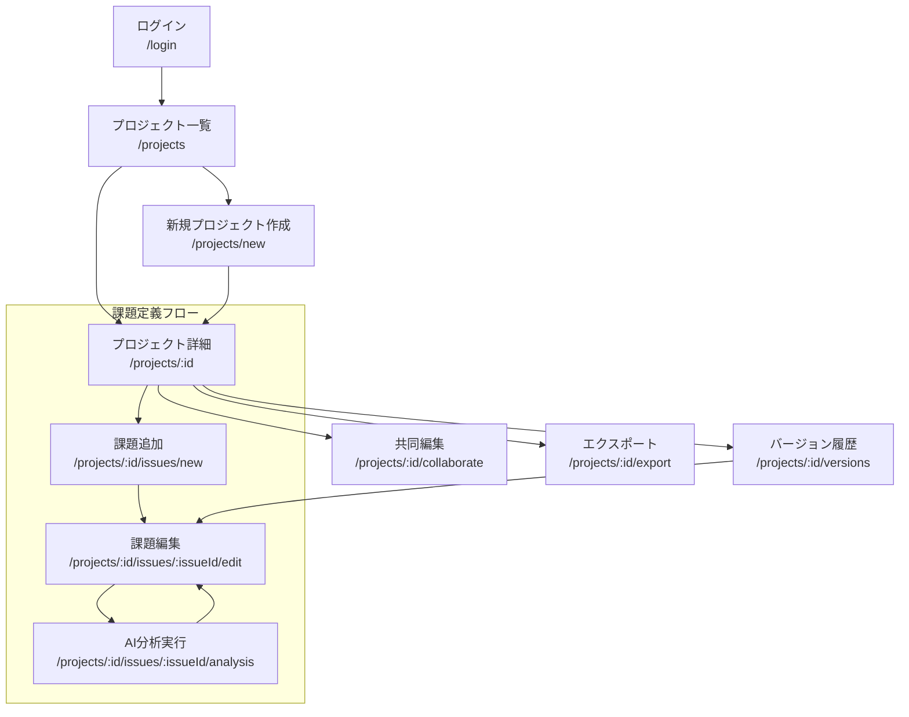

# User Flow — SOLVISTA

```mermaid
graph TD
  %% Primary Pages
  PageA["ログイン<br/>/login"]
  PageB["プロジェクト一覧<br/>/projects"]
  PageC["プロジェクト詳細<br/>/projects/:id"]

  %% Authentication Flow
  PageA --> PageB

  %% Project Management Flow
  PageB --> PageC
  PageB --> PageB1["新規プロジェクト作成<br/>/projects/new"]

  %% Core Business Features - Issue Definition
  subgraph "課題定義フロー"
    PageC --> PageC1["課題追加<br/>/projects/:id/issues/new"]
    PageC1 --> PageC2["課題編集<br/>/projects/:id/issues/:issueId/edit"]
    PageC2 --> PageC3["AI分析実行<br/>/projects/:id/issues/:issueId/analysis"]
  end

  %% Collaboration Features
  PageC --> PageC4["共同編集<br/>/projects/:id/collaborate"]
  PageC --> PageC5["バージョン履歴<br/>/projects/:id/versions"]

  %% Export Feature
  PageC --> PageC6["エクスポート<br/>/projects/:id/export"]

  %% Cross-page Navigation
  PageB1 --> PageC
  PageC3 --> PageC2
  PageC5 --> PageC2
```
